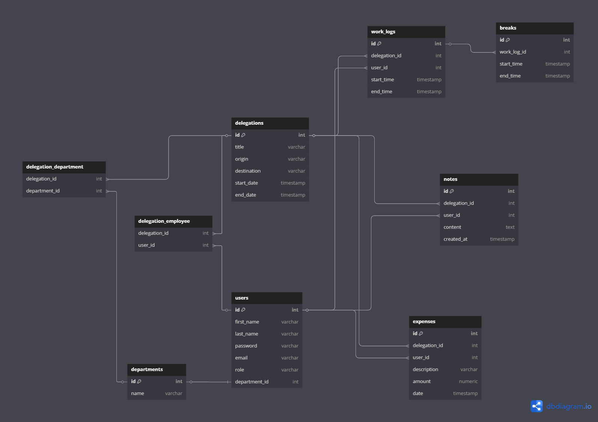

# System do zarządzania delegacjami

## Funkcjonalności
### Wymagane
- Start, stop, pauza czasu pracy podczas delegacji
- Dodawanie notatek do delegacji
- Monitorowanie kosztów podczas delegacji
- Generowanie raportów z zakończonych delegacji

### Opcjonalne
- Planowanie podróży

## Schemat bazy danych

## Stos technologiczny
### Frontend
- Angular
- Typescript

### Backend
- Java
- Springboot

### Baza danych
- PostgreSQL